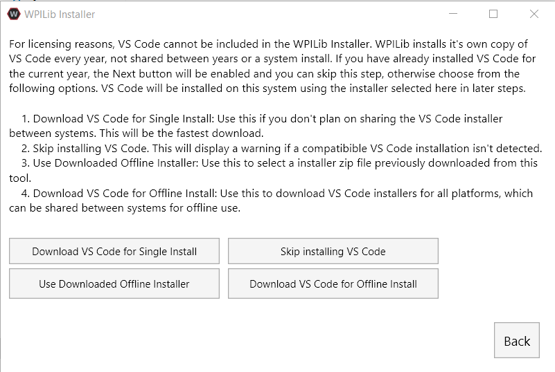
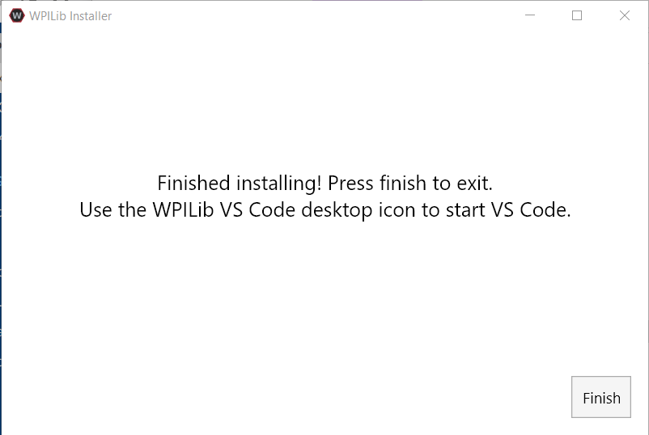
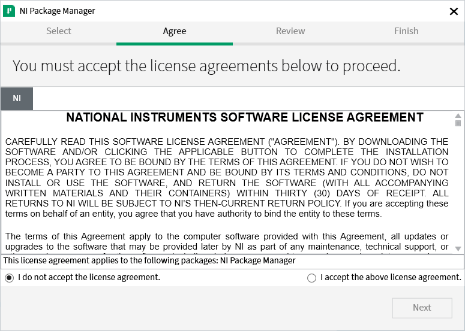
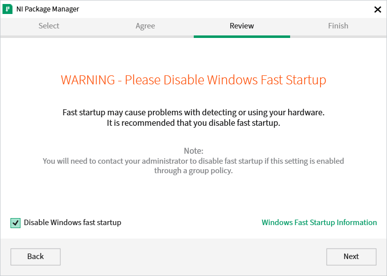
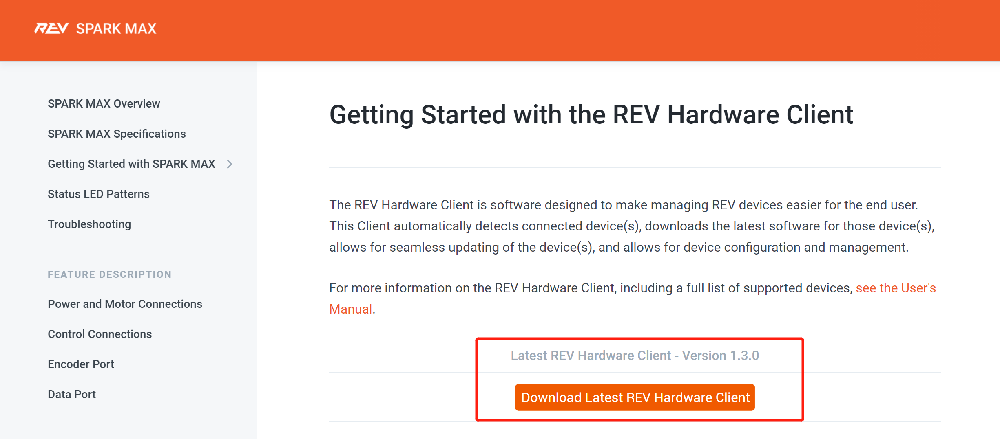
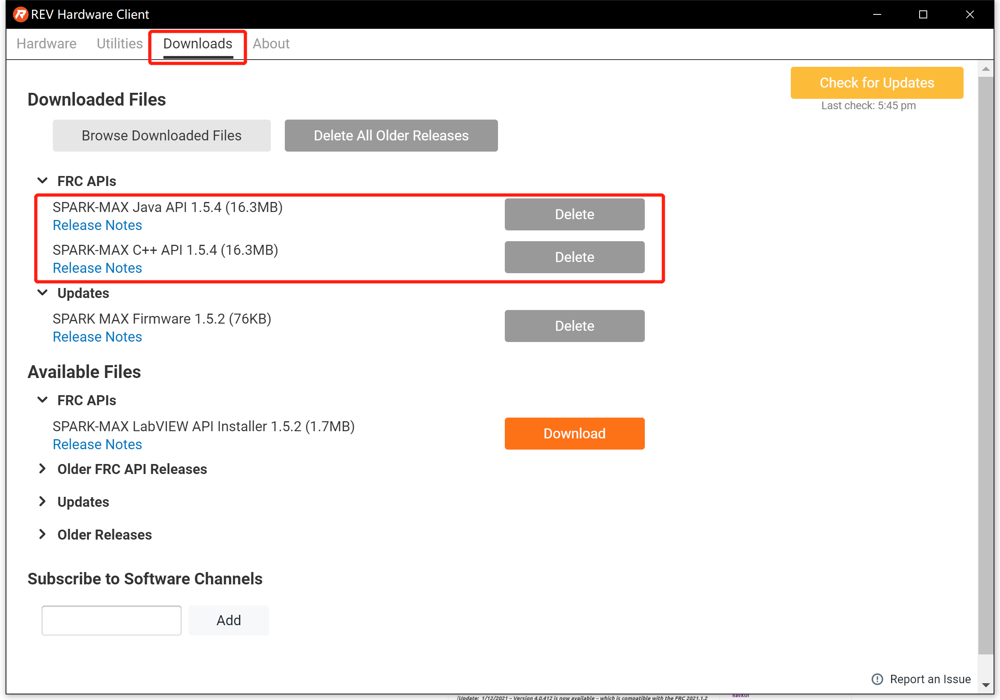

中文简体 | ...

# NI 环境搭建指南

 

## FRC官方库与VSCode安装指南

1. 进入 **FRC编程手册**官网(此步可忽略，直接进入第三步)。

    [FIRST Robotics Competition Control System](https://docs.wpilib.org/en/stable/index.html)

2. 进入 **WPILib Installation Guide** (此步可忽略，直接进入第三步)(路径：ZERO TO ROBOT/Step 2: Installing Software/WPILib Installation Guide)

    [WPILib Installation Guide](https://docs.wpilib.org/en/stable/docs/zero-to-robot/step-2/wpilib-setup.html)

3. 参照**页面内容**直接从Github下载对应自己系统版本的**最新完整压缩包**(**建议做法**)。

    [wpilibsuite/allwpilib/releases](https://github.com/wpilibsuite/allwpilib/releases)

    - 右键管理员模式运行installer，点击**Start**开始安装。

      

    - 点击 **Download VS Code for Single Install**

      

    - 选择**Install for all User**，等待安装完成即可

      

      
      
      

    > 注意: 你也可以选择单独下载VSCode，并在拓展市场里下载"WPILIB"插件以配置环境(不建议)

4. 压缩包解压完毕后管理员模式下运行安装器, 选择**All User**, 从**安装器内直接下载VSCode**，参照默认设置完整安装(**建议做法**) 。

5. 从桌面**新快捷方式**进入VSCode

    
    

## 2. FRC其他重要程序的安装

1. **FRC Game Tools** (路径：ZERO TO ROBOT/Step 2: Installing Software/Installing the FRC Game Tools)

    包含： **LabVIEW Update**, **FRC Driver Station**, **FRC Utilities**( 比如**roboRIO Imaging Tool**)

    [FRC Game Tools](https://packages.wpilib.workers.dev/game-tools/ni-frc-2024-game-tools_24.0.0_offline.iso)

    - 选择 **I accept the above license agreement**，并继续

      

    - 选择取消掉Windows的快速启动，并继续

      

    - 选择继续，等待安装完成

      

      

      > 注意: 在这一步安装的过程中可能会出现报错，并自动会跳到之前的安装界面，在这种情况下可以直接按照之前的选项继续安装下去，不用关掉软件重新启动，这种情况一般是由于服务器连接不稳定造成的。

    - 如果看到这个页面，请继续选择安装，接下来的步骤与之前一致

      

      

      

      

    - 重启以完成安装

      
      
      > 注意: 使用离线版安装器可以避免服务器连接不良导致的安装失败，离线版本的安装器可以在同链接下载。

2. **FRC Radio Configuration** (路径：Step 3: Preparing Your Robot/Programming your Radio)

    用于：**设置无线路由器**

    [FRC Radio Configuration 20.0.0](https://docs.wpilib.org/en/stable/docs/zero-to-robot/step-3/radio-programming.html)
    
3. **第三方库**(路径：VS Code Overview/3rd Party Libraries)

    用于：配置使用Spark Max 和 Talon FX等电调或NavX等传感器。

    [CTRE Phoenix Framework](https://github.com/CrossTheRoadElec/Phoenix-Releases/releases)

    - 选择对应的系统版本下载安装即可

      

    [REV Lib](https://docs.revrobotics.com/sparkmax/rev-hardware-client/getting-started-with-the-rev-hardware-client)
    
    - 直接下载客户端安装即可
    
      
    
    - 安装后打开**REV Hardware Client**
    
      
    
    - 在**Downloads**界面下选择API下载即可(注意：2021年以后API将随REV客户端的安装自动安装)
    
      
    
    [Kauai Labs](https://pdocs.kauailabs.com/navx-mxp/software/roborio-libraries/)
    
    - 直接下载安装客户端即可
    
      

## 3. 检验环境

1. 进入**安装好 WPILib插件** 的VSCode。

2. 从右上角 **W状图标** 处启动插件。

3. 选择 "**新建一个项目**" (Create a new project)。

4. 参照以下设置创建一个New Command Base架构的程序模板。

    

5. Build程序模板(**一般会在第一次进入模板后自动执行**)，显示 **"Build Successful"** 之后即可继续编程，若出现 **"Build Failed"** 或 **未出现成功字样** ，则是环境搭建**出现问题**，请参照之前步骤寻找原因。

    
